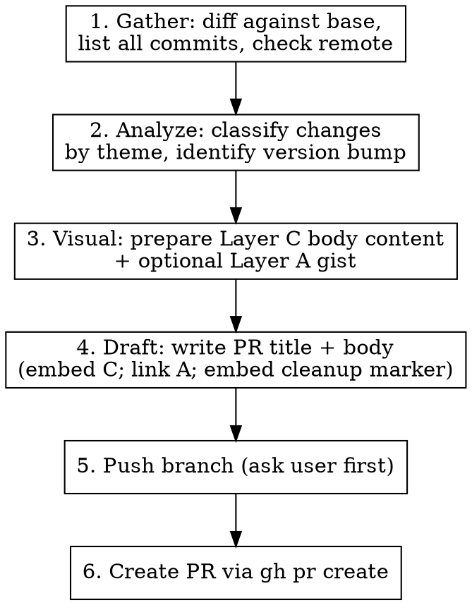
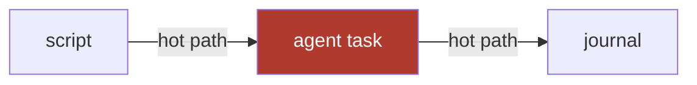

# GitHub Pull Request

Create well-structured GitHub pull requests with theme-organized descriptions, an inline visual review surface (Mermaid + PNG + collapsibles), and an optional full-fidelity HTML explainer hosted on a secret gist.

## Why a visual review surface matters

AI-authored PRs are often large or technically deep, and the human reviewer cannot fully absorb them from a flat markdown bullet list. The skill enforces two layers of visual scaffolding:

- **Layer C — inline in the PR body**: Mermaid diagrams, drag-dropped PNGs, `<details>` folded file tours, severity-chipped risk tables. Renders natively on github.com — zero friction.
- **Layer A — full HTML explainer (optional)**: A self-contained `.html` page with margin-pinned diff annotations, inline SVG module map, and side-by-side before/after. Stored locally (gitignored), uploaded to a **secret gist**, linked from the PR body via [`htmlpreview.github.io`](https://htmlpreview.github.io).

Layer C is mandatory for non-trivial PRs. Layer A is recommended for the same. Neither layer touches `git` history.

## Workflow



## Step 1 — Gather

Run these in parallel:

```bash
# Untracked files
git status

# Full diff against base branch
git diff <base-branch>...HEAD --stat
git diff <base-branch>...HEAD

# All commits on this branch
git log <base-branch>..HEAD --oneline --no-merges

# Check remote tracking
git rev-parse --abbrev-ref --symbolic-full-name @{u} 2>/dev/null || echo "NO_UPSTREAM"
```

### Determining the base branch

This is a single-package library. PRs target `main` unless a release branch is in play.

| Scenario | Base branch |
|----------|-------------|
| Feature / fix / docs branch | `main` |
| Work targeting a release line | the release branch (e.g. `release/0.1.x`) |

When in doubt, ask the user.

## Step 2 — Analyze

### Classify changes by theme

Group commits by **module / area of the codebase** (e.g. orchestration runtime, journal, determinism guard, meta layer, deepagents integration), not by change type.

For large PRs (10+ commits, 3+ modules), create themed sections with `###` headings. For small PRs (1-5 commits, 1-2 modules), use a flat bullet list under Summary.

### Identify version bump

If the public API surface changed, note the version bump. This package's version lives in `pyproject.toml` (`[project] version`) and is exposed at runtime via `__version__`.

```markdown
### Version Bump

`langchain-dynamic-workflow`: 0.1.0 → 0.2.0 (new public API)
```

Only include this when the version actually changed.

## Step 3 — Visual review surface

### When to attach

| PR shape | Layer C (body) | Layer A (gist) |
|---|---|---|
| ≥ 200 LOC, OR ≥ 3 files non-trivial, OR architectural, OR new subsystem | **Mandatory** | **Recommended** |
| Cross-cutting (≥ 2 modules) | **Mandatory** | **Recommended** |
| New ADR introduced or existing ADR superseded | **Mandatory** | **Recommended** |
| 50–200 LOC, single module | **Recommended** | Optional |
| < 50 LOC, docs-only, config bump, single-file mechanical refactor | Skip | Skip |

### Layer C — inline body content (mandatory when triggered)

Compose these elements into the PR body. Each element renders natively on github.com:

1. **One-line TL;DR** below the Summary heading — a sentence a non-expert can parse.
2. **Risk table** — every changed file with a severity chip (🟥 needs careful review · 🟨 worth a look · 🟩 safe). Markdown table with emoji chips.
3. **Mermaid module map / data flow** — required when ≥ 3 files touched or architecture changed. Use a ` ```mermaid ` fenced block. Highlight the hot path with `style nodeName fill:#b03a2e,color:#fff`.
4. **Before / After PNGs** — drag-drop into the PR body. Hosted on `user-attachments`, not in repo. For behavior/API/perf: rendered diff or numbers table screenshot.
5. **Collapsible file tour grouped by role of change** — `<details><summary>` per group: *Plumbing*, *Core logic*, *Tests*, *Docs*, *Cleanup*. One sentence of *why* per file, with `path:line` anchors.
6. **Where to focus** — a top-of-body call-out with 1–3 numbered priorities pointing at specific files, ordered by review urgency.
7. **Test plan** — checklist with actual counts (`42 passed`).
8. **Open questions** — explicit questions for the reviewer; empty list is acceptable.

Bullets must be skim-friendly. No prose paragraphs longer than 3 sentences.

### Layer A — full HTML explainer (recommended)

Higher fidelity for the 20% of reviewers who want margin-pinned annotations, inline SVG, and the full eight-section explainer.

1. **Generate locally** — copy `references/visual-explainer-template.html` to `.claude/pr-artifacts/pr-<slug>.html` (slug = kebab-case PR title, ≤ 40 chars). The path is gitignored — the file never enters history.
2. **Fill in all eight sections** per `references/visual-explainer.md`: motivation → risk map → before/after → module map (inline SVG) → file tour → annotated diff for high-risk files → test plan → open questions.
3. **Honour the 5-second rule** in the first viewport: title, TL;DR, stats bar, "Where to focus", jump-link nav. No hero, no gradient.
4. **Self-contained** — inline `<style>` + `<script>` + `<svg>`. Zero external assets. Must render opened from `file://` with no network.
5. **Upload as a secret gist** (`gh gist create` defaults to secret/unlisted; use `--public` only to opt out):

    ```bash
    GIST_URL=$(gh gist create \
      --desc "[PR-artifact] <PR title>" \
      .claude/pr-artifacts/pr-<slug>.html | tail -1)
    GIST_ID=$(basename "$GIST_URL")
    GH_USER=$(gh api user --jq .login)
    PREVIEW_URL="https://htmlpreview.github.io/?https://gist.githubusercontent.com/${GH_USER}/${GIST_ID}/raw/pr-<slug>.html"
    echo "Gist ID:  $GIST_ID"
    echo "Preview:  $PREVIEW_URL"
    ```

    Requires `gist` scope on the gh token; run `scripts/setup-pr-artifacts.sh` once if it's missing.
6. **Embed the cleanup marker** — add this exact line in the PR body (anywhere, even at the very bottom) so `.github/workflows/pr-artifact-cleanup.yml` can find and delete the gist when the PR closes:

    ```html
    <!-- pr-artifact-gist: <GIST_ID> -->
    ```

    > **Note**: auto-cleanup is handled by `.github/workflows/pr-artifact-cleanup.yml` when the PR closes. It requires the `GIST_DELETE_TOKEN` repo secret (a PAT with `gist` scope) — run `scripts/setup-pr-artifacts.sh` for the setup steps. Without the secret the workflow no-ops harmlessly; clean up gists manually with `gh gist delete <id>`.

For the full Layer A spec — eight required sections, severity chip palette, forbidden styling, mobile rules — read `references/visual-explainer.md`. Do not skip it on a complex PR.

## Step 4 — Draft

### PR Title

Follow conventional commit format, under 70 characters:

```
<type>(<scope>): <short description>
```

| Type | When |
|------|------|
| `feat` | New feature or capability |
| `fix` | Bug fix |
| `refactor` | Code restructuring without behavior change |
| `chore` | Build, deps, config, tooling |
| `docs` | Documentation only |

**Scope rules:**
- Single module: use its short name — `feat(runtime): ...`, `fix(journal): ...`
- Multiple modules: use the primary one or omit scope — `feat: ...`
- Compound scope for closely related areas: `feat(runtime+journal): ...`

### PR Body — Small PR (sub-50 LOC, single concept)

```markdown
## Summary

- Bullet point describing change 1
- Bullet point describing change 2

## Test plan

- [x] Verified test or check (already done)
- [ ] Pending manual verification step

🤖 Generated with [Claude Code](https://claude.com/claude-code)
```

### PR Body — Medium / Large PR (Layer C mandatory)

```markdown
## Summary

1-3 sentence high-level overview.

**TL;DR.** <one line a non-expert can parse>.

## Where to focus

1. **<file:line>** — <why this is the highest-priority read>
2. **<file:line>** — <next priority>
3. **<file:line>** — <next priority>

## Visual review

> Full interactive explainer (Layer A — optional):
> <PREVIEW_URL from Step 3.A.5>




## Risk map

| File | Severity | Why |
|---|---|---|
| `src/langchain_dynamic_workflow/runtime.py` | 🟥 careful | new public API; check determinism guard |
| `src/langchain_dynamic_workflow/journal.py` | 🟨 worth a look | refactor, behavior preserved |
| `tests/test_runtime.py` | 🟩 safe | mechanical |

## Changes by Theme

### 1. Theme Name

- **module**: Description of change

### 2. Another Theme

- Description with technical detail

## File tour

<details><summary><strong>Plumbing</strong> (2 files)</summary>

- `path/to/wiring.py` — registers the new component.
- `path/to/config.py` — exposes the new option.

</details>

<details><summary><strong>Core logic</strong> (3 files)</summary>

- `path/to/core.py:120` — the actual behavior change; see Layer A diff annotations.

</details>

<details><summary><strong>Tests</strong> (4 files)</summary>

- ...

</details>

### Version Bump

`langchain-dynamic-workflow`: 0.1.0 → 0.2.0

## Test plan

- [x] Unit tests — 42 passed
- [x] `uv run ruff check` + `uv run pyright` — clean
- [ ] Manual E2E: <describe>

## Open questions

1. <question for reviewer, or "None — ready for review">

🤖 Generated with [Claude Code](https://claude.com/claude-code)

<!-- pr-artifact-gist: <GIST_ID if Layer A was uploaded; omit line otherwise> -->
```

### Writing rules

- **Language**: English for PR title and body. Chinese acceptable in body for very large PRs when the author prefers it.
- **Theme-first**: Organize by module/area in large PRs, not by change type.
- **Test plan is mandatory**: Every PR must have a test plan section.
- **Checkbox convention**: `[x]` = already verified before PR creation. `[ ]` = pending.
- **Test results**: Include actual test counts — `42 passed`, not `tests pass`.
- **Resolves/Closes**: Add `Resolves #N` on its own line if applicable.
- **Signature**: Always end with `🤖 Generated with [Claude Code](https://claude.com/claude-code)`.
- **Cleanup marker**: If Layer A was uploaded, include `<!-- pr-artifact-gist: <id> -->` at the very bottom.
- **No labels by default**: Unless the user specifies labels.

## Step 5 — Push Branch

Confirm with the user before pushing. Use `-u` to set upstream:

```bash
git push -u origin <branch-name>
```

## Step 6 — Create PR

```bash
gh pr create \
  --base <base-branch> \
  --title "<title>" \
  --body "$(cat <<'EOF'
<full PR body here, including <!-- pr-artifact-gist: <id> --> marker if Layer A used>
EOF
)"
```

Use a HEREDOC for `--body` to preserve Markdown formatting. Return the PR URL to the user when done.

### Flags reference

| Flag | When |
|------|------|
| `--base <branch>` | Always specify explicitly |
| `--draft` | When work is incomplete or seeking early feedback |
| `--assignee @me` | When user wants self-assignment |
| `--reviewer <user>` | When user specifies reviewers |
| `--label <label>` | When user specifies labels |

## One-time setup

Before the first PR that uses Layer A on a given machine, the user must grant the `gist` scope to their gh token:

```bash
bash .claude/skills/github-pr/scripts/setup-pr-artifacts.sh
```

This script:
1. Verifies `gh` is installed and authenticated.
2. Runs `gh auth refresh -s gist` if the scope is missing.
3. Tests that `gh gist create` works.
4. Prints the steps to create the `GIST_DELETE_TOKEN` repo secret that `.github/workflows/pr-artifact-cleanup.yml` needs for auto-cleanup when a PR closes.

## Quick Reference

| Task | Command |
|------|---------|
| Diff against base | `git diff <base>...HEAD --stat` |
| Commits on branch | `git log <base>..HEAD --oneline --no-merges` |
| Push with upstream | `git push -u origin <branch>` |
| Create PR | `gh pr create --base <base> --title "..." --body "..."` |
| Create draft PR | `gh pr create --draft --base <base> --title "..." --body "..."` |
| View PR | `gh pr view <N>` |
| Edit PR body | `gh pr edit <N> --body "..."` |
| Add reviewer | `gh pr edit <N> --add-reviewer <user>` |
| List my PRs | `gh pr list --author @me` |
| Upload explainer gist | `gh gist create --desc "[PR-artifact] <title>" <file>` |
| List my PR-artifact gists | `gh gist list --limit 100 \| grep "[PR-artifact]"` |
| Delete a gist manually | `gh gist delete <id>` |

## Common Mistakes

| Mistake | Fix |
|---------|-----|
| Title too long (80+ chars) | Keep under 70 chars; details go in the body |
| Missing test plan | Always include, even if just `- [x] ruff + pyright pass` |
| Test plan says "tests pass" without counts | Include actual counts: `42 passed` |
| Organizing body by feat/fix/chore | Organize by **theme/module** for large PRs |
| Not checking for uncommitted changes | Run `git status` first |
| Pushing without confirming | Always ask the user before push |
| Skipping Layer C on a 500-LOC, 4-file PR | Always attach for mandatory shapes (see Step 3 table) |
| Committing `.claude/pr-artifacts/` files | They are gitignored — `git status` should never list them |
| Pasting raw `<script>`/`<style>` into PR body | GitHub strips them — use Mermaid + PNG + `<details>` instead |
| Uploading the `.html` as a drag-drop attachment | GitHub serves `.html` as download, not rendered — must go via secret gist + htmlpreview |
| HTML explainer pulls in remote CSS/JS/fonts | Single self-contained file: inline `<style>` + `<script>` + `<svg>`, zero external assets |
| File tour ordered alphabetically or by directory | Group by *role of change* — Plumbing / Core logic / Tests / Docs / Cleanup |

## Branch Naming Conventions

| Pattern | When | Example |
|---------|------|---------|
| `feat/<short-name>` | Standalone feature branch | `feat/pipeline-scheduler` |
| `fix/<short-name>` | Standalone bugfix branch | `fix/journal-hash-collision` |
| `docs/<short-name>` | Documentation branch | `docs/quickstart-guide` |
| `refactor/<short-name>` | Refactoring branch | `refactor/runtime-host-bindings` |

## References

- `references/visual-explainer.md` — full spec for Layer A: when to attach, 5-second rule, eight required sections, severity chip palette, forbidden styling. Read before producing the artifact.
- `references/visual-explainer-template.html` — starter HTML template with all eight sections wired up (inline CSS, inline SVG module-map example, annotated-diff layout, dark-mode palette). Copy and fill in.
- `scripts/setup-pr-artifacts.sh` — one-time `gh` token / scope setup for Layer A.
- `.github/workflows/pr-artifact-cleanup.yml` — auto-deletes the secret gist when the PR closes, by reading the `<!-- pr-artifact-gist: <id> -->` marker.
- Thariq Shihipar, *The Unreasonable Effectiveness of HTML* — https://thariqs.github.io/html-effectiveness/ (canonical source; see `17-pr-writeup.html` and `03-code-review-pr.html`).
