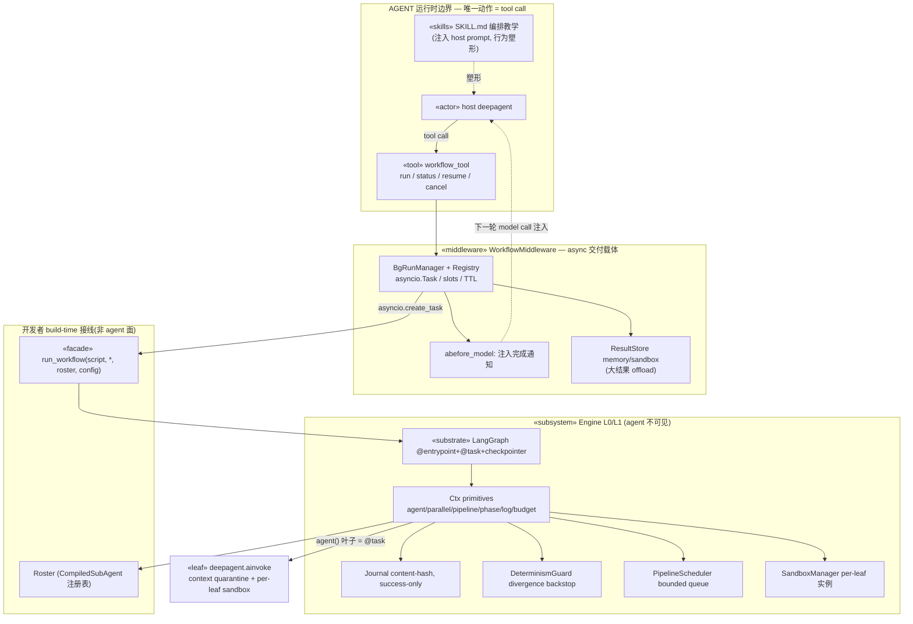

# UML · 组件图（Component）

## 三条要确立的边界

1. **agent 唯一运行时面 = `workflow_tool`**(一次 tool call)。库 API `run_workflow()`、primitives 都是 build-time / 开发者面,不是 agent 面。
2. **middleware 是 async 通知的交付载体**:`abefore_model` 在 host agent 下一轮 model call 前注入完成通知(in-band,无需 harness)。
3. **引擎对 agent 完全不可见**:中间结果、leaf 扇出、journal、sandbox 全在 tool 之下;agent context 只收最终结论——control-flow inversion 的对外体现。

## 两层 scope（勿混）

- **host 面后台 tool 包装**(MW):让 host agent 不被 `run_workflow` 阻塞。
- **引擎内部 durable execution**(ENG):`@task`/parallel/journal/sandbox,在 `run_workflow` 内部、与 host middleware 不同 scope。
