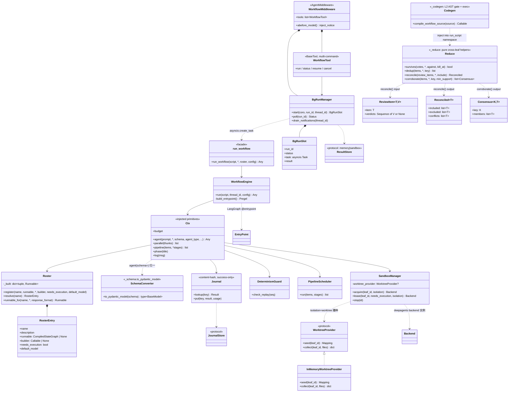

# UML · 类图（Class）

## 分层归属

- **公共面(开发者)**：`run_workflow`、`Roster`/`RosterEntry`、`create_workflow_tool`(产 `WorkflowTool`)、`create_workflow_middleware`(产 `WorkflowMiddleware`)、`InMemoryWorktreeProvider`/`WorktreeProvider`(worktree 隔离 seam)、`read_only_leaf`/`read_only_builder`(只读裁判叶,deny-write permission,D-G4)、跨叶归约 helper `survives`/`dedup`/`reconcile`/`corroborate`(+ `ReviewItem`/`Reconciled`/`Consensus`,`_reduce` 纯函数,F)。
- **agent 面(运行时)**：`WorkflowTool`(多命令)。
- **host 后台机制**：`WorkflowMiddleware` + `BgRunManager` + `BgRunSlot` + `ResultStore`。
- **引擎核心(不可见)**：`WorkflowEngine`、`Ctx`、`Journal`(+`JournalStore`)、`DeterminismGuard`、`PipelineScheduler`、`SandboxManager`、`SchemaConverter`(`_schema.to_pydantic_model`,把 JSON-schema dict 归一为 pydantic 模型)、`Codegen`(`_codegen`,L2 AST gate + 受限 `exec`,**依赖 `_reduce`** 把归约 helper 注入 `run_script` 命名空间——故 import-linter "L2 不得触 L0/L1 内部" 契约的 `forbidden_modules` 不含 `_reduce`)。`Roster` 经 `runnable_for(response_format)` 按 `(agent_type, schema)` 缓存绑定变体,builder 条目供 `agent(schema=)`。
- **底座**：LangGraph `@entrypoint`/`@task`/checkpointer/`BaseStore`；deepagents `CompiledSubAgent`/`AgentMiddleware`/`SkillsMiddleware`/backend。
