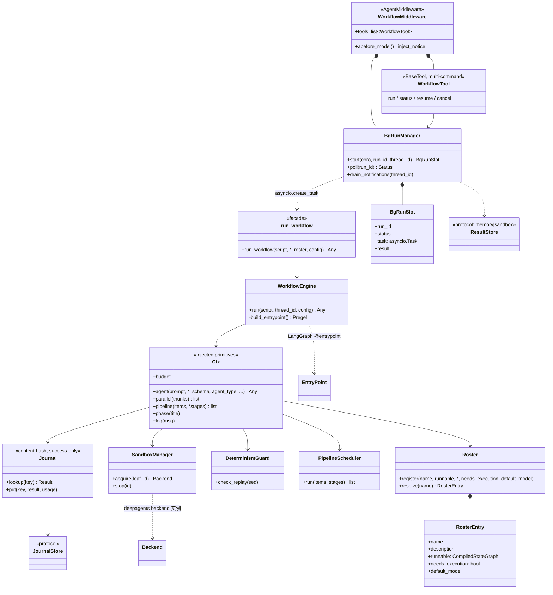

# UML · 类图（Class）

## 分层归属

- **公共面(开发者)**：`run_workflow`、`Roster`/`RosterEntry`、`create_workflow_tool`(产 `WorkflowTool`)、`create_workflow_middleware`(产 `WorkflowMiddleware`)。
- **agent 面(运行时)**：`WorkflowTool`(多命令)。
- **host 后台机制**：`WorkflowMiddleware` + `BgRunManager` + `BgRunSlot` + `ResultStore`。
- **引擎核心(不可见)**：`WorkflowEngine`、`Ctx`、`Journal`(+`JournalStore`)、`DeterminismGuard`、`PipelineScheduler`、`SandboxManager`。
- **底座**：LangGraph `@entrypoint`/`@task`/checkpointer/`BaseStore`；deepagents `CompiledSubAgent`/`AgentMiddleware`/`SkillsMiddleware`/backend。
