# UML · 类图（Class）

```mermaid
classDiagram
  class run_workflow {
    <<facade>>
    +run_workflow(script, *, roster, config) Any
    +on_progress / on_span / on_span_begin / on_leaf_event sinks
    +leaf_event_include_payloads: bool
  }
  class WorkflowEngine {
    +run(script, thread_id, config) Any
    -build_entrypoint() Pregel
  }
  class Ctx {
    <<injected primitives>>
    +agent(prompt, *, schema, agent_type, ...) Any
    +parallel(thunks) list
    +pipeline(items, *stages) list
    +race(candidates, *, win, win_tag) RaceResult
    +phase(title)
    +log(msg)
    +budget
  }
  class Roster {
    -_built: dict~tuple, Runnable~
    +register(name, runnable, *, builder, needs_execution, default_model)
    +resolve(name) RosterEntry
    +runnable_for(name, *, response_format) Runnable
  }
  class RosterEntry {
    +name
    +description
    +runnable: CompiledStateGraph | None
    +builder: Callable | None
    +needs_execution: bool
    +default_model
  }
  class SchemaConverter {
    <<_schema.to_pydantic_model>>
    +to_pydantic_model(schema) type~BaseModel~
  }
  class Journal {
    <<content-hash, success-only>>
    +lookup(key) Result
    +put(key, result, usage)
    +journal_key(*, prompt, agent_type, ...) str
    +race_key(*, candidate_keys, win_tag) str
  }
  class JournalStore { <<protocol>> }
  class DeterminismGuard { +check_replay(seq) }
  class PipelineScheduler { +run(items, stages) list }
  class SandboxManager {
    +acquire(leaf_id, isolation) Backend
    +lease(leaf_id, needs_execution, isolation) Backend
    +stop(id)
    -worktree_provider: WorktreeProvider?
  }
  class WorktreeProvider {
    <<protocol>>
    +seed(leaf_id) Mapping
    +collect(leaf_id, files) dict
  }
  class InMemoryWorktreeProvider {
    +seed(leaf_id) Mapping
    +collect(leaf_id, files) dict
  }
  class WorkflowTool {
    <<BaseTool, multi-command>>
    +run / status / resume / cancel
  }
  class WorkflowMiddleware {
    <<AgentMiddleware>>
    +tools: list~WorkflowTool~
    +abefore_model() inject_notice
  }
  class BgRunManager {
    +start(coro, run_id, thread_id) BgRunSlot
    +poll(run_id) Status
    +drain_notifications(thread_id)
  }
  class BgRunSlot {
    +run_id
    +status
    +task: asyncio.Task
    +result
  }
  class ResultStore { <<protocol: memory|sandbox>> }
  class WorkflowRunStore {
    <<protocol: _run_store, run 注册表持久化边界>>
    +save_spec(run_id, spec) async
    +delete_spec(run_id) async
    +load_spec(run_id) RunSpec or None async
    +journal_for(run_id) JournalStore
  }
  class RunSpec {
    <<frozen+slots: 可 resume 的 launch 描述>>
    +kind: str (name or script)
    +name_or_source: str
    +args: dict (JSON-可序列化)
    +label: str
    +journal_run_id: str or None
  }
  class InMemoryRunStore {
    <<默认, 零依赖>>
    -_specs: dict
    -_journals: dict~run_id, JournalStore~
  }
  class SqliteWorkflowStore {
    <<M3, [sqlite] extra: 统一 db 文件 + 两连接>>
    +open(db_path)$ SqliteWorkflowStore async
    +checkpointer: AsyncSqliteSaver
    +aclose() async
    -_store_conn: Connection (autocommit, WAL)
    -_checkpointer_conn: Connection (第二连接)
  }
  class RunScopedJournal {
    <<_persistence: 一个 run_id 的 JournalStore 视图>>
    +get / put / get_sequence / put_sequence
    +get_progress_count / put_progress_count
  }
  class Reduce {
    <<_reduce: pure cross-leaf helpers>>
    +survives(votes, *, against, kill_at) bool
    +dedup(items, *, key) list
    +reconcile(review_items, *, include) Reconciled
    +corroborate(items, *, key, min_support) list~Consensus~
  }
  class ReviewItem~T,V~ {
    +item: T
    +verdicts: Sequence of V or None
  }
  class Reconciled~T~ {
    +included: list~T~
    +excluded: list~T~
    +conflicts: list~T~
  }
  class Consensus~K,T~ {
    +key: K
    +members: list~T~
  }
  class RaceCandidate {
    <<_race_types: content-hashable agent-call spec>>
    +prompt: str
    +agent_type: str
    +schema: type or dict or None
    +model: str or None
    +isolation: str
  }
  class RaceResult~T~ {
    +winner: T or None
    +winner_index: int or None
    +won: bool
  }
  class Codegen {
    <<_codegen: L2 AST gate + exec>>
    +compile_workflow_source(source) Callable
  }
  class SpanRecorder {
    <<_observability: 开 span, 发 begin+end 两条带外边>>
    +span(kind, name) ActiveSpan
    -_mint_span_id(kind, name) str
    -_sink: SpanSink
    -_begin_sink: SpanBeginSink
  }
  class SpanBegin {
    <<_observability: span 打开即发的 running 边>>
    +span_id: str
    +kind: SpanKind
    +name: str
    +attributes: dict
    +started_at: float
    +monotonic_start: float
  }
  class Span {
    <<_observability: span 关闭时发的完成边>>
    +span_id: str
    +kind: SpanKind
    +name: str
    +attributes: dict
    +duration_s: float
    +error: str or None
  }
  class LeafEvent {
    <<_leaf_events: 叶子回调子树的一条 normalize 边>>
    +leaf_span_id: str
    +run_id: str
    +parent_run_id: str or None
    +kind: str (chain|chat_model|llm|tool)
    +phase: str (start|end|error)
    +name: str
    +ts: float
    +detail: dict (默认 shape-only)
  }
  class LeafEventHandler {
    <<_leaf_events: BaseCallbackHandler, 引擎内部, 一叶一实例>>
    +on_chain_start / on_chat_model_start / on_tool_start ...
    -_leaf_span_id: str (构造时闭包持有 → 关联)
    -_include_payloads: bool
  }

  run_workflow --> WorkflowEngine
  WorkflowEngine --> Ctx
  WorkflowEngine ..> EntryPoint : LangGraph @entrypoint
  Ctx --> Journal
  Ctx --> DeterminismGuard
  Ctx --> PipelineScheduler
  Ctx --> SandboxManager
  Ctx --> Roster
  Ctx ..> SchemaConverter : agent(schema=) 归一
  Journal ..> JournalStore
  Roster *-- RosterEntry
  SandboxManager ..> Backend : deepagents backend 实例
  SandboxManager ..> WorktreeProvider : isolation=worktree 播种
  WorktreeProvider <|.. InMemoryWorktreeProvider
  WorkflowMiddleware *-- WorkflowTool
  WorkflowMiddleware *-- BgRunManager
  WorkflowTool --> BgRunManager
  BgRunManager *-- BgRunSlot
  BgRunManager ..> ResultStore
  BgRunManager ..> run_workflow : asyncio.create_task
  WorkflowTool ..> WorkflowRunStore : save/load spec + journal_for(canonical)
  WorkflowRunStore ..> RunSpec : save_spec / load_spec
  WorkflowRunStore ..> JournalStore : journal_for() returns
  WorkflowRunStore <|.. InMemoryRunStore
  WorkflowRunStore <|.. SqliteWorkflowStore
  SqliteWorkflowStore ..> RunScopedJournal : journal_for() view (run_id-scoped)
  SqliteWorkflowStore ..> EntryPoint : checkpointer = AsyncSqliteSaver (第二连接)
  RunScopedJournal ..|> JournalStore
  Reduce ..> ReviewItem : reconcile() input
  Reduce ..> Reconciled : reconcile() output
  Reduce ..> Consensus : corroborate() output
  Codegen ..> Reduce : inject into run_script namespace
  Codegen ..> RaceCandidate : inject into run_script namespace
  Codegen ..> RaceResult : inject into run_script namespace
  Ctx ..> RaceCandidate : race() candidate spec
  Ctx ..> RaceResult : race() return
  Ctx ..> Journal : race_key() journals the decision
  WorkflowEngine --> SpanRecorder : SpanRecorder(sink=on_span, begin_sink=on_span_begin)
  Ctx --> SpanRecorder : span() per primitive (mints span_id, threads into leaf_runner)
  SpanRecorder ..> SpanBegin : 打开即 emit (begin sink)
  SpanRecorder ..> Span : 关闭时 emit (end sink)
  WorkflowEngine ..> LeafEventHandler : 叶调用接缝 append 到 leaf_config.callbacks (miss-only, 闭包持 leaf_span_id)
  LeafEventHandler ..> LeafEvent : normalize 回调边 → on_leaf_event sink
```

## 分层归属

- **公共面(开发者)**：`run_workflow`、`Roster`/`RosterEntry`、`create_workflow_tool`(产 `WorkflowTool`)、`create_workflow_middleware`(产 `WorkflowMiddleware`)、`InMemoryWorktreeProvider`/`WorktreeProvider`(worktree 隔离 seam)、`read_only_leaf`/`read_only_builder`(只读裁判叶,deny-write permission,D-G4)、跨叶归约 helper `survives`/`dedup`/`reconcile`/`corroborate`(+ `ReviewItem`/`Reconciled`/`Consensus`,`_reduce` 纯函数,F)、race 值类型 `RaceCandidate`/`RaceResult`(+ `race_key`,`_race_types` 纯类型,B,配 `ctx.race` 原语)、可观测性值类型与 sink 别名 `Span`/`SpanBegin`/`SpanKind`/`LeafEvent`(+ `SpanSink`/`SpanBeginSink`/`LeafEventSink`,M1,供宿主消费 `run_workflow` 的 `on_span`/`on_span_begin`/`on_leaf_event` 带外边)。`LeafEventHandler` 是引擎内部(不导出)的回调 normalizer,一叶一实例、闭包持 `leaf_span_id` 关联(见 [01 §2b](../01-engine-mechanism.md))。
- **agent 面(运行时)**：`WorkflowTool`(多命令)。
- **host 后台机制**：`WorkflowMiddleware` + `BgRunManager` + `BgRunSlot` + `ResultStore`。
- **跨会话持久化(M3,Layer 2 host-wiring)**：`WorkflowRunStore`(协议)+ `RunSpec`(可 resume 的 launch 描述,携规范 `journal_run_id` 谱系)+ `InMemoryRunStore`(默认、零依赖)+ `SqliteWorkflowStore`(`[sqlite]` extra:统一 sqlite db 文件 + 两条连接——autocommit store 背 registry + `RunScopedJournal` per-run journal、第二连接背持久 `AsyncSqliteSaver` checkpointer)。`_persistence` / `_run_store` 只从 `._engine`(公共墙)import `JournalStore`/`JournalRecord`,故 import-linter Contract 1 把这两模块列入 `source_modules`。零成本重放由持久 journal 交付,checkpointer 是 durable add-on。
- **引擎核心(不可见)**：`WorkflowEngine`、`Ctx`、`Journal`(+`JournalStore`)、`DeterminismGuard`、`PipelineScheduler`、`SandboxManager`、`SchemaConverter`(`_schema.to_pydantic_model`,把 JSON-schema dict 归一为 pydantic 模型)、`Codegen`(`_codegen`,L2 AST gate + 受限 `exec`,**依赖 `_reduce` 与 `_race_types`** 把归约 helper 与 race 值类型注入 `run_script` 命名空间——故 import-linter "L2 不得触 L0/L1 内部" 契约的 `forbidden_modules` 既不含 `_reduce` 也不含 `_race_types`)。`Roster` 经 `runnable_for(response_format)` 按 `(agent_type, schema)` 缓存绑定变体,builder 条目供 `agent(schema=)`。
- **底座**：LangGraph `@entrypoint`/`@task`/checkpointer/`BaseStore`；deepagents `CompiledSubAgent`/`AgentMiddleware`/`SkillsMiddleware`/backend。
