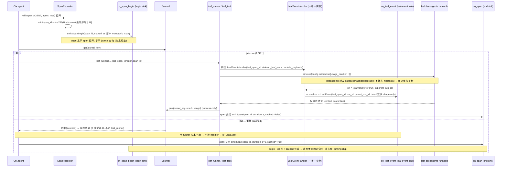

# UML · 时序图（Sequence）

## A — async run → notify（核心闭环）

```mermaid
sequenceDiagram
  participant A as host agent
  participant T as workflow_tool
  participant M as WorkflowMiddleware / BgRunManager
  participant E as run_workflow (Engine @entrypoint)
  participant L as leaf deepagents

  A->>T: tool call run(script)
  T->>M: start(run_workflow(script), run_id)
  M->>M: asyncio.create_task(...) 登记 slot
  M-->>A: 即返占位 ToolMessage(run_id)
  Note over A: agent 不阻塞, 继续别的回合/对话
  par 后台脱离运行
    M->>E: 执行
    E->>E: compile/exec script → Ctx
    alt agent(schema=) 结构化分支
      E->>E: to_pydantic_model(schema) 归一 → ToolStrategy(model, handle_errors=True)
      E->>L: roster.runnable_for(response_format) 取 @task 叶 → 扇出
      L-->>E: structured_response (context quarantine)
      E->>E: fold_structured → journal 存 model_dump_json + usage
    else schema-less 文本分支
      E->>L: agent()/parallel()/pipeline() = @task 扇出
      L-->>E: 仅最终文本 (context quarantine)
      E->>E: fold_result → journal(success-only) + usage; 中间不出引擎
    end
    E-->>M: 最终结论
    M->>M: done callback → 入队通知 + offload 大结果
  end
  A->>M: (下一轮) abefore_model
  M-->>A: 注入 workflow_notification (完成 + 摘要 + run_id)
  A->>T: status / get_result(run_id)
  T-->>A: 最终结论 (或转换 / 摘要)
```

**要点**:`run` 即返占位 → agent 不阻塞;真正执行脱离在后台 `asyncio.Task`;完成经 `abefore_model` **in-band 注入**(无需 harness);agent 经 `status` 取全量结果(大结果 offload)。poll + notify 双支持。

## B — resume（中断后）

```mermaid
sequenceDiagram
  participant A as host agent
  participant T as workflow_tool
  participant E as run_workflow @entrypoint
  participant J as Journal

  A->>T: resume(run_id)
  T->>E: 重放 entrypoint (同 thread_id)
  E->>J: 每个 agent() 查 content-hash (schema dict 先 to_pydantic_model 归一再入 key)
  J-->>E: 命中(success) → 返缓存 (0 模型调用)
  E->>E: 有 schema → model_validate_json 还原结构化对象; 无 schema → 返缓存文本
  E->>E: 未命中 → live 重跑(runnable_for 取缓存绑定变体); 序列不匹配 → fail-loud
  E-->>T: 续跑至最终结论
  T-->>A: 结果
```

**要点**:resume 靠 `@entrypoint` 重放 + content-hash journal(success-only)命中返缓存;带 `schema` 的叶子命中以 `model_validate_json` 还原结构化对象(归一缓存保 `model_json_schema()` 逐字节稳定 → 不静默重跑);只有未完成/失败的叶子 live 重跑(`runnable_for` 取已缓存的 schema 绑定变体);调用序列漂移 → 确定性 backstop fail-loud。

## C — race（fresh / replay：best-of-N 早退 + 取消）

```mermaid
sequenceDiagram
  participant E as Ctx.race
  participant G as DeterminismGuard
  participant J as Journal
  participant L as candidate agent() 叶 (×N)

  Note over E: 前奏(同步, 任何派发之前)
  E->>E: resolve 每个候选 + journal_key(候选叶 key) + 同构校验(全无 schema 或全同一 schema)
  E->>E: race_key(candidate_keys, win_tag) ("race" 命名空间, 绝不撞叶 key)
  alt 深度 0(顶层 race)
    E->>G: observe(race_key) (候选 agent() 在深度 > 0, 不入序列)
  end
  E->>J: get(race_key)
  alt fresh — 未命中
    E->>L: 并发派发全部 N 候选 (经 agent() 复用 journal/budget/sandbox/span)
    L-->>E: 候选结果陆续抵达 (asyncio.wait FIRST_COMPLETED)
    E->>E: 同一 wakeup 按升序下标决断 → 首个令 win(result) 为真者胜
    E->>L: cancel 在飞 loser → gather(return_exceptions=True) 拆除(无孤儿/不漏闸位)
    alt 有胜者
      E->>J: put(race_key, envelope{winner_index, result}, winner_usage)
      Note over E: 胜者 usage 取自其叶 entry; race-key 不重复计入 budget(防双计)
      E-->>E: 返 RaceResult(winner, winner_index)
    else 无胜者
      Note over E: 不 journal 决策(resume 可重试)
      E-->>E: 返 RaceResult(None, None)
    end
  else replay — 命中
    J-->>E: envelope{winner_index, result}
    E->>E: budget.record(race_key, usage) + decode(有 schema 则 model_validate_json)
    Note over E: 零派发 — loser 永不重跑, resume 比首跑更省
    E-->>E: 返 RaceResult(winner, winner_index)
  end
```

**要点**:race 是一步顺序决策——其 content-stable `race_key` 仅在深度 0 由确定性 guard `observe` 一次,候选 `agent()` 调用跑在深度 > 0、不入序列(完成顺序逐跑不同,同 `parallel`/`pipeline` 叶);fresh 路并发派发、首个令 `win` 为真者胜(同一 wakeup 按升序下标确定性决断)、在飞 loser 在 `finally` 里 cancel + `gather(return_exceptions=True)` 拆除(无孤儿、闸位全释放),胜者写一个自包含 envelope `{winner_index, result}` 到 journal;replay 路命中即解码 envelope 复现胜者、**零派发**;无胜者**不** journal,resume 可重试。引擎控制流信号(budget/确定性)或 `win` 谓词抛错则在拆除 loser 后失声而抛(fail-loud)。

## D — 跨进程 resume（M3:进程 A launch+persist → 退出 → 进程 B reopen+resume 零成本）

```mermaid
sequenceDiagram
  participant PA as 进程 A host
  participant SA as SqliteWorkflowStore (db 文件)
  participant EA as run_workflow @entrypoint
  participant DB as sqlite db 文件 (run_specs + journal_*)
  participant PB as 进程 B host (全新进程)
  participant SB as SqliteWorkflowStore (同一 db 文件)
  participant EB as run_workflow @entrypoint
  participant JB as 持久 journal (RunScopedJournal)

  Note over PA,SA: 进程 A — launch + persist
  PA->>SA: await SqliteWorkflowStore.open(db_path) (宿主持久 loop 内)
  SA->>DB: 开两连接 (autocommit store + 第二连接 AsyncSqliteSaver) + WAL + schema-version guard
  PA->>SA: workflow_tool run(...) → mint run_id → canonical = run_id
  SA->>SA: save_spec(run_id, RunSpec{journal_run_id=run_id}) BEFORE start
  SA->>DB: UPSERT run_specs (durable, autocommit, 零显式 commit)
  PA->>EA: manager.start(_coro, thread_id=host_thread) ; 引擎 thread_id=canonical
  loop 每个完成叶
    EA->>JB: put(leaf_key, JournalRecord) (run_id 命名空间)
    JB->>DB: UPSERT journal_records (durable on return)
  end
  EA-->>PA: 最终结论 (run 完成)
  PA->>SA: await store.aclose() → 关两连接 (释放 -wal/-shm)
  Note over PA: 进程 A 退出

  Note over PB,SB: 进程 B — 全新进程, 同一 db 文件
  PB->>SB: await SqliteWorkflowStore.open(db_path) (新 loop, 新 AsyncSqliteSaver)
  SB->>DB: schema-version 命中 → 幂等 proceed
  PB->>SB: workflow_tool resume(run_id)
  SB->>DB: load_spec(run_id) → RunSpec{journal_run_id=run_id}
  SB-->>PB: spec (canonical = spec.journal_run_id)
  PB->>EB: relaunch ; 引擎 thread_id=canonical ; journal=journal_for(canonical)
  loop 重放 entrypoint body
    EB->>JB: get(leaf_key) (run_id 命名空间)
    JB->>DB: SELECT journal_records
    DB-->>EB: 命中(success) → 缓存结果 (0 模型调用 — journal 交付, 非 checkpointer)
  end
  EB-->>PB: 续跑至最终结论 (完成叶零新成本)
```

**要点**:**头条 = journal 交付零成本重放,checkpointer 是 durable add-on**(resume 侧即便 `checkpointer=None` 仍零成本)。autocommit store 连接让每条 `put()` 返回即 durable(零显式 commit);第二条连接背 `AsyncSqliteSaver`(隔离 regime 不兼容,故分连接、同 db 文件,皆 WAL)。`AsyncSqliteSaver` 构造期绑 event loop——进程 B 是全新 loop + 全新 saver 实例(绝不跨 loop 复用)。**per-run 规范 id**(`journal_run_id`,fresh launch 采自身 `run_id`、resume 从 spec 继承)同 key journal 谱系与引擎 `thread_id`(checkpoint thread),故不同 run 不撞、resume 重接原 thread;**host thread 是另一回事**——只 key manager slot。**save-before-start**:`save_spec` 先于 `manager.start`,被准入的 run 总有可 resume 的 spec(quota 拒入则 `delete_spec` 回滚)。`journal_key` 跨 `PYTHONHASHSEED` 逐字节稳定 → A 进程写的键 B 进程命中。已知边界:`race()` 无胜者不 journal → 跨进程 resume 会重派候选。

## E — agent() span 生命周期 + 逐叶 live 可观测性（begin 边 / 叶回调 tap / cached 路）



**要点**:`on_span_begin` 全 span 类型、打开即发,**不**被 replay 抑制——故 cached 叶子也重发 begin、再配一条 `cached=True`、`duration_s≈0` 的完成 `Span`,渲染成即时命中而非卡住 running chip。`on_leaf_event` 只在 journal **miss** 走真叶子时挂 `LeafEventHandler`(命中走缓存路径根本不进 leaf runner),故**重放叶子零 interior 事件**——replay 策略随控制流自落、无需额外开关。关联靠 handler 实例**构造时闭包持有的 `leaf_span_id`**,不靠 metadata 继承(deepagents subagent 边界丢弃 metadata,只转发 `callbacks`/`tags`/`configurable`)。两条边皆走带外、不进宿主 LLM 上下文(quarantine 保持);`detail` 默认 shape-only,原始 payload 仅 `leaf_event_include_payloads=True` 时带、截断有界。`span_id` 顺序深度-0 path resume 稳定(同源序重放 + 序号每 run 重置),扇出 span 因打开顺序随墙钟不担保。执行叶子真 shell `execute` 的命令生命周期(`on_command` / `CommandEvent`,在 subprocess 边界发成对 begin/end 边、归位到所属叶 `leaf_span_id`)是同一 miss-only 带外可观测性面的执行面同构体,机制见 F 图。

## F — 真本地执行后端（M5:工厂 → lease → 守卫复合 → execute 准入/spawn/抽干/超时组杀 + on_command → teardown）

```mermaid
sequenceDiagram
  participant H as host (build-time)
  participant SM as SandboxManager
  participant F as SandboxFactory (local_subprocess_factory)
  participant B as LocalSubprocessSandbox (per-leaf 临时根)
  participant GB as _GuardedBackend / CompositeBackend
  participant DA as leaf deepagents (aexecute → to_thread)
  participant EG as ExecGate (threading.BoundedSemaphore, 一工厂一闸)
  participant BE as before_execute (准入钩子)
  participant CE as on_command (CommandEvent sink)
  participant P as Popen 子进程 (+ POSIX 进程组)
  participant DR as drain worker 线程

  Note over H,SM: build-time opt-in (危险, 非安全 sandbox)
  H->>SM: SandboxManager(sandbox_factory=local_subprocess_factory(ExecPolicy(...)))
  SM->>F: 构造期建一只共享 exec_gate(max_concurrent_execs)

  Note over SM,B: 执行叶 lease (needs_execution=True)
  SM->>F: _new_sandbox(leaf_id) → factory(leaf_id)
  F->>B: LocalSubprocessSandbox(identity, policy, exec_gate) — mkdtemp 临时根
  SM->>B: set_command_sink(sink=on_command, leaf_span_id, include_payloads) (仅 on_command 接入时, miss-only 由 lease 路天然保持)
  SM->>GB: build_leaf_backend(isolated=B, /shared/ → SharedArtifactStore)
  Note over GB: 引擎 lease/teardown 路径不变; isinstance(B, SandboxBackendProtocol) 闸已纳

  Note over DA,P: 叶子调 execute (跑在 to_thread worker 上, 同步体)
  DA->>GB: execute(command) → 委派 _isolated.execute
  GB->>B: execute(command, *, timeout)
  B->>EG: acquire() (finally 必 release; 与叶级 ConcurrencyGate 正交)
  B->>BE: before_execute(ExecRequest(command, timeout, leaf_id))
  alt reject — 不 spawn
    BE-->>B: ExecDecision(outcome=reject, reason)
    B-->>GB: ExecuteResponse(reason, exit_code=126, truncated=False)
  else allow — 真 spawn
    BE-->>B: ExecDecision(allow [可缩超时/降 cap/选 RLimitProfile])
    B->>B: 解析有效超时(取最紧) / output cap / rlimits
    opt on_command 已接入
      B->>B: mint command_id = sha256(leaf_span_id+command+叶内出现序号)[:16]
      B->>CE: emit CommandEvent(phase=start, command, started_at, exit_code=None)
    end
    B->>P: Popen(cwd=临时根, stdout=PIPE, stderr=STDOUT, start_new_session=POSIX) [POSIX 经最小 preexec_fn setrlimit (父预算 soft/hard)]
    Note over B,P: begin 边已画 running card ⇒ end 边必随, Popen/preexec 失败补发 spawn-error end (同 command_id, exit_code=127) 再抛
    B->>DR: 起 drain worker — 分块读, 过 cap 标 truncated + 续读到 EOF (防满管道)
    B->>P: proc.wait(有效超时) (调用线程)
    alt 超时
      B->>P: killpg SIGTERM → grace 窗 → killpg SIGKILL (整组连子孙; 码 124)
    else 干净退出
      P-->>B: returncode
    end
    B->>P: finally reap proc.wait() + join drain + close pipe (无僵尸/孤儿/漏线程/漏 fd)
    DR-->>B: (output, truncated)
    opt on_command 已接入
      B->>CE: emit CommandEvent(phase=end, exit_code, output 默认截尾, truncated, duration_s) (同 command_id, card 原地翻 pass/fail)
    end
    B-->>GB: ExecuteResponse(output, exit_code [124 超时 否则 returncode], truncated)
  end
  B->>EG: release() (finally)
  GB-->>DA: ExecuteResponse
  Note over CE: 命令文本/输出可观测性走专门带外 sink on_command (on_leaf_event 在执行面的同构 sink), miss-only — journal 命中叶不 lease 不跑 subprocess, InMemorySandbox 不发

  Note over SM,B: teardown / eviction
  SM->>B: stop(leaf_id) / reclaim_idle / _evict_one_idle → _close_backend → close()
  B->>B: shutil.rmtree(临时根) (幂等; 子进程已在每次 execute reap)
```

**要点**:**执行变真无需改引擎**——只需 build-time 注入工厂;lease/`_GuardedBackend`/teardown 路径原样复用(`_GuardedBackend.execute` 已委派被租隔离后端、`isinstance(SandboxBackendProtocol)` 闸已纳)。`execute` 跑在 deepagents 的 `aexecute → to_thread(self.execute)` worker 上,故 `ExecGate` 是**跨线程** `threading.BoundedSemaphore`(`finally` 必还闸位)、与叶级 asyncio `ConcurrencyGate` **正交**;一工厂一闸 ⇒ 一 run 并发 exec 上限全局。`before_execute` 是**准入控制**(allow / reject 返 126 不 spawn / 缩超时只可收紧 / 降 cap / 选 `RLimitProfile`),非可观测性 sink。命令可观测性走**专门的带外 sink `on_command`**——execute 体内在 spawn 前后发成对 `CommandEvent`(`"start"`/`"end"`,共享 resume 稳定 `command_id`、携 `leaf_span_id`),是 `on_leaf_event` 在执行面的同构 sink:miss-only(journal 命中叶不 lease 不跑 subprocess 故零 command 事件;`InMemorySandbox` 无真 execute 边界不发),`output` 默认截尾、`command_include_payloads` 才带全量;引擎仅在 lease 真后端时经 `set_command_sink` 接上,begin 边画 running card 后纵 spawn 失败也以同 `command_id`/`exit_code=127` 补发 end 边再抛(card 绝不卡死)。有界抽干跑在 worker、调用线程 `wait(超时)`:超时则 POSIX `killpg` SIGTERM→grace→SIGKILL 整组杀(`start_new_session` 连子孙)、码 124;每路 `finally` reap + join + close,**无僵尸/孤儿/漏线程/漏 fd**。rlimit 经**最小化 `preexec_fn`**(父进程预算 soft/hard 值、子侧只 `setrlimit` 不分配/不 import/不取锁,故 fork-then-exec 窗口内安全;不另起 `python -c` wrapper 省每命令一次解释器启动),默认 generous-but-bounded profile ON(POSIX;Windows best-effort 无 rlimit/无进程组)。teardown `close()` 删临时根、幂等。诚实非目标:per-leaf 临时根只界定默认工作目录、**非安全 sandbox**(命令仍能经绝对路径读写宿主 FS / 用网络 / 超 best-effort rlimit 耗资源);container/cgroup/网络隔离与真 git-worktree 后端在 backlog。

## G — 运行中 HITL 签核（M4:暂停在门 → AWAITING_SIGNOFF → approve 注入决策续跑）

```mermaid
sequenceDiagram
  participant U as 人(host/UI)
  participant T as workflow tool
  participant M as BgRunManager
  participant W as run_workflow (一次 .ainvoke)
  participant C as Ctx.checkpoint
  participant J as journal (per-run, 跨调用持久)

  Note over U,J: 回合 1 — run 停在签核门
  U->>T: run <workflow>
  T->>M: start(coro = run_workflow(...))  (后台)
  M->>W: 执行脚本
  W->>C: ctx.agent(门前叶) → 记入 journal
  W->>C: ctx.checkpoint(ask, tag)
  C->>J: get(signoff_key(position, tag))
  alt 无记录决策 且 无 pending_signoff
    C-->>W: raise WorkflowSignoffRequired(ask, gate_key)
    W-->>M: 异常冒泡(注:门前叶已 journal,但 finalize/put_sequence 不跑 → D4 重叙述边界)
    M->>M: _run_wrapped 捕获 → _park: slot.status=AWAITING_SIGNOFF, slot.ask=ask, 入 notice
  end
  U->>T: status <run_id>
  T-->>U: awaiting_signoff + ask(如何 approve)

  Note over U,J: 回合 2 — approve 注入人工决策,续跑
  U->>T: approve <run_id> args={"approved": true, ...}
  alt 本进程在活的 parked slot (status==AWAITING_SIGNOFF)
    T->>M: approve(coro2 = run_workflow(resume=decision), run_id) — 先同步翻 RUNNING(杜绝双批竞争)再就地替换 slot.task(同 run_id)
  else UNKNOWN(swept / 跨进程)— parked 态未持久化,无法核实确在门上
    T-->>U: 拒批("not awaiting sign-off on this process";以免把非 parked run 推过门)
  end
  M->>W: 重执行脚本(从头)
  W->>C: ctx.agent(门前叶) → journal 命中,零成本重放
  W->>C: ctx.checkpoint(ask, tag)
  C->>J: get(signoff_key(position, tag))
  alt 无记录决策 但有 pending_signoff
    C->>J: put(signoff_key, decision) 并消费 pending
    C-->>W: 返回 decision(脚本据真人工决策分支)
  end
  W-->>M: 干净返回结果 → slot.status=DONE
  U->>T: status <run_id> → done + result
  Note over T,J: demo 内联路:run_workflow_live 捕 WorkflowSignoffRequired,经 _ResumeLane 跨轮持久 journal 续跑;awaiting/approved 卡片同 event_id=signoff-{gate_key} 原地翻面
```

**要点**:签核门**走 journal,不用 LangGraph 原生 `interrupt`**(C8 spike 否决:checkpointer 的 `@task` index 缓存与 content-hash journal 短路在 resume 时错位,实测叶 B 拿到叶 A 缓存)。park 与 approve 是**两次独立 `run_workflow` 调用**,各持自己的 per-call `InMemorySaver`,journal 是唯一跨调用缓存 ⇒ 无 `@task` index 错位、`checkpointer=None` 即可、跨进程骑持久 journal。门按 `signoff_key(position, tag)` 取键(序号 = 本 run 第几个 checkpoint 调用),故 `ctx.checkpoint` 是 **depth-0 原语**(fan-out 内序号竞争 → 抛 `WorkflowCheckpointError`,已并入 `WORKFLOW_CONTROL_FLOW_SIGNALS` fail-loud)。`AWAITING_SIGNOFF` 非终态、计入 `active_run_count`(abandoned park 由 `sweep` 经 `park_ttl_seconds` 过期回收)。`approve` **只批准本进程在活的 parked run**:`BgRunManager.approve` 先同步翻 `RUNNING` 再排续跑(杜绝双批竞争出孤儿续跑),就地复用 parked slot(**同 run_id**,卡片据 id 跨暂停原地更新);UNKNOWN(swept/跨进程)拒批——parked 态未持久化,无法核实确在门上(评审 M1)。`approve`(注入人工值)与 `resume`(崩溃重放、无值注入)是不同动词。脚本体在 approve 时从头重执行 ⇒ 门前叶决策走 journal 重放免费,但非幂等脚本副作用重复(D4 边界);**进度叙述不再重发**(park 时持久 progress_count)。安全:门入确定性序列(漂移 fail-loud)、决策须 JSON-可序列化(消费前序列化)、注入决策无门消费 → fail-loud、authored 脚本经 AST gate 禁 `ctx.checkpoint`。机制见 [01 §14](../01-engine-mechanism.md),host 接线见 [02 §11](../02-architecture.md)。
